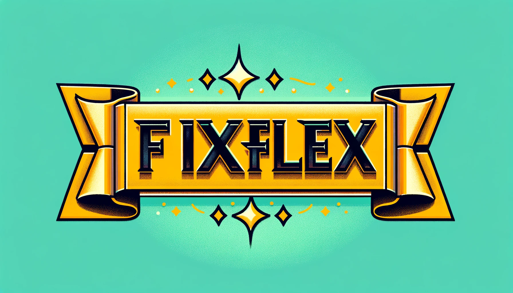
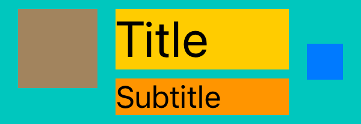
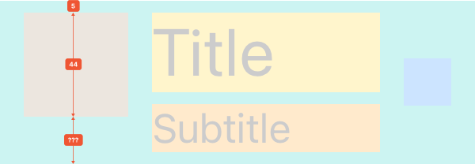
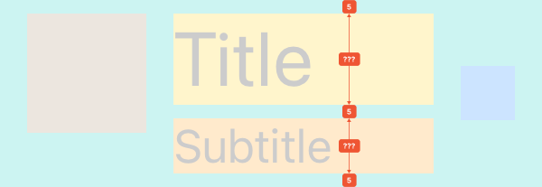
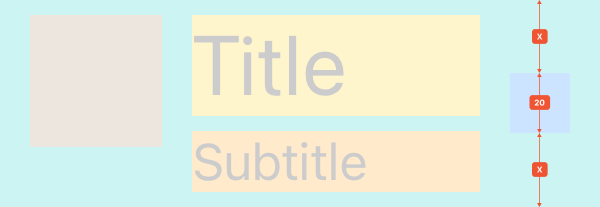
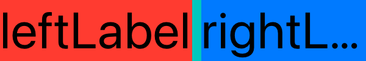
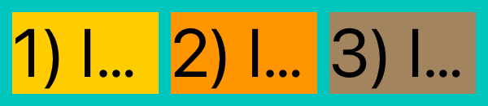
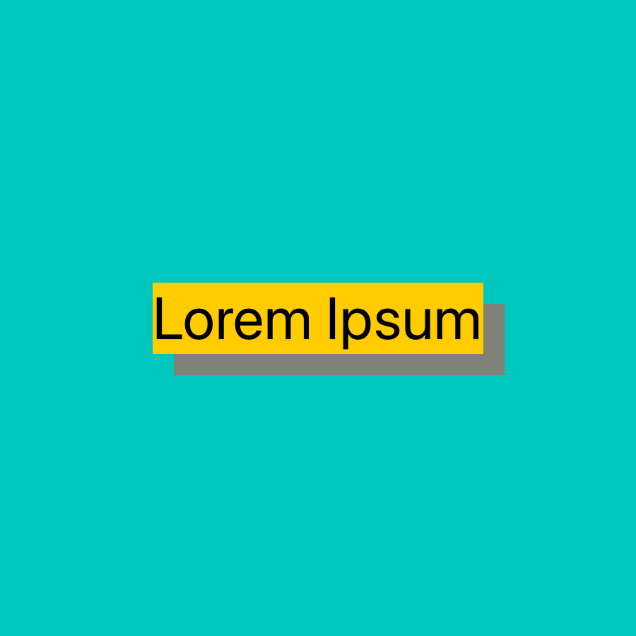

<p align="center">

</p>
      
`FixFlex` is a simple yet powerful Auto Layout library built on top of the NSLayoutAnchor API, a swifty and type-safe reimagination of [Visual Format Language](https://developer.apple.com/library/archive/documentation/UserExperience/Conceptual/AutolayoutPG/VisualFormatLanguage.html)

## Features

- Auto Layout code that is easy to write, read, and modify
- Simple API with 2 functions and 4 modifiers
- Lightweight, implementation is only 300 lines of code
- Compatible with any other Auto Layout code
- Basically generates a bunch of `NSLayoutConstraint` and `UILayoutGuide`
- Super straightforward mental model
- Typesafe alternative to VFL
- Automatically sets `translatesAutoresizingMaskIntoConstraints` to false
- Supports iOS 12.0+ / Mac OS X 10.13+ / tvOS 12.0+

## Usage

Imagine we want to create a layout like this:



1. Let's 'scan' the layout horizontally and translate it into FixFlex code:


The title and subtitle widths can vary on different devices, which is why we use the Flex intent for them:

```swift
parent.fx.hput(Fix(10),
               Fix(iconView, 44),
               Fix(5),
               Flex([titleLabel, subtitleLabel]),
               Fix(5),
               Fix(chevron, 20),
               Fix(10))
```

2. Vertically, we have three different groups of views. Let's start with the icon:



We pin `iconView` to the top of the parent with an offset of 5pt. The bottom padding is at least 5pt, but can be more (for the case when the labels' height + 5 is less than the icon's height):

```swift
parent.fx.vput(Fix(5),
               Fix(iconView, 44),
               Flex(min: 5))
```

3. Next is the vertical scan of the title and subtitle:



```swift
parent.fx.vput(Fix(5),
               Flex(titleLabel),
               Fix(5),
               Flex(subtitleLabel),
               Fix(5))
```

4. Finally, the vertical scan of the chevron:



To center the chevron, the top padding should be equal to the bottom one. We use Split for this:

```swift
parent.fx.vput(Split(),
               Fix(chevron, 20),
               Split())
```

## API

`FixFlex` provides two functions for laying out UIViews or NSViews, accessible through the 'fx' namespace.

- `view.fx.hput(...)`: handles the horizontal layout of views
- `view.fx.vput(...)`: handles the vertical layout of views

Both `hput` and `vput` process an array of `PutIntent`. A `PutIntent` is essentially an instruction on how to calculate the width or height for a view, an array of views, or a spacer (a UILayoutGuide is created for a `PutIntent` with a not specified view).

`PutIntent` types:

- `Fix`: This is used when you know the exact size of the view/spacer.
- `Flex`: This is particularly useful for view/spacer whose size may change dynamically based on content. It can also have minimum or maximum value constraints.
- `Split`: This is used when you want the size of one view/spacer to be the same as another. It's typically used for equal spacing or for creating symmetrical layouts.
- `Match`: The size will match some other NSLayoutDimension. This is useful when you want to align the sizes of different view/spacer or make them proportional to each other.

## Examples


### Fill Parent With Inset


```swift
let child = UIView()
child.backgroundColor = .systemYellow

let parent = UIView()
parent.translatesAutoresizingMaskIntoConstraints = false
parent.backgroundColor = .systemMint
parent.addSubview(child)

parent.widthAnchor.constraint(equalToConstant: 200).isActive = true
parent.heightAnchor.constraint(equalToConstant: 100).isActive = true

parent.fx.hput(Fix(15), Flex(child), Fix(15))
parent.fx.vput(Fix(15), Flex(child), Fix(15))
```


### Pin To Parent Trailing Bottom


```swift
let child = UIView()
child.backgroundColor = .systemYellow

let parent = UIView()
parent.translatesAutoresizingMaskIntoConstraints = false
parent.backgroundColor = .systemMint
parent.addSubview(child)

parent.widthAnchor.constraint(equalToConstant: 200).isActive = true
parent.heightAnchor.constraint(equalToConstant: 100).isActive = true

parent.fx.hput(Flex(),
               Fix(child, 100),
               Fix(15))

parent.fx.vput(Flex(),
               Fix(child, 50),
               Fix(15))
```


### Center In Parent


```swift
let child = UIView()
child.backgroundColor = .systemYellow

let parent = UIView()
parent.translatesAutoresizingMaskIntoConstraints = false
parent.backgroundColor = .systemMint
parent.addSubview(child)

parent.widthAnchor.constraint(equalToConstant: 200).isActive = true
parent.heightAnchor.constraint(equalToConstant: 100).isActive = true

parent.fx.hput(Split(),
               Fix(child, 100),
               Split())

parent.fx.vput(Split(),
               Fix(child, 50),
               Split())
```


### Center Label In Parent


```swift
let label = UILabel()
label.text = "topLabel"
label.font = .preferredFont(forTextStyle: .title1)
label.adjustsFontForContentSizeCategory = true
label.backgroundColor = .systemYellow

let parent = UIView()
parent.translatesAutoresizingMaskIntoConstraints = false
parent.backgroundColor = .systemMint
parent.addSubview(label)

parent.widthAnchor.constraint(equalToConstant: 200).isActive = true
parent.heightAnchor.constraint(equalToConstant: 200).isActive = true

parent.fx.hput(Split(),
               Flex(label),
               Split())

parent.fx.vput(Split(),
               Flex(label),
               Split())
```


### Vertically Center Two Labels


```swift
let topLabel = UILabel()
topLabel.text = "topLabel"
topLabel.font = .preferredFont(forTextStyle: .title1)
topLabel.adjustsFontForContentSizeCategory = true
topLabel.backgroundColor = .systemYellow

let bottomLabel = UILabel()
bottomLabel.text = "bottomLabel"
bottomLabel.font = .preferredFont(forTextStyle: .caption1)
bottomLabel.adjustsFontForContentSizeCategory = true
bottomLabel.backgroundColor = .systemOrange

let parent = UIView()
parent.translatesAutoresizingMaskIntoConstraints = false
parent.backgroundColor = .systemMint
parent.addSubview(topLabel)
parent.addSubview(bottomLabel)

parent.widthAnchor.constraint(equalToConstant: 200).isActive = true
parent.heightAnchor.constraint(equalToConstant: 200).isActive = true

parent.fx.hput(Flex([topLabel, bottomLabel]))

parent.fx.vput(Split(),
               Flex(topLabel),
               Fix(5),
               Flex(bottomLabel),
               Split())
```


### Cell With Icon Title Subtitle And Chevron


```swift
let iconView = UIView()
iconView.backgroundColor = .systemBrown

let titleLabel = UILabel()
titleLabel.text = "Title"
titleLabel.font = .preferredFont(forTextStyle: .title1)
titleLabel.adjustsFontForContentSizeCategory = true
titleLabel.backgroundColor = .systemYellow

let subtitleLabel = UILabel()
subtitleLabel.text = "Subtitle"
subtitleLabel.font = .preferredFont(forTextStyle: .body)
subtitleLabel.adjustsFontForContentSizeCategory = true
subtitleLabel.backgroundColor = .systemOrange

let chevron = UIView()
chevron.backgroundColor = .systemBlue

let parent = UIView()
parent.translatesAutoresizingMaskIntoConstraints = false
parent.backgroundColor = .systemMint

parent.addSubview(iconView)
parent.addSubview(titleLabel)
parent.addSubview(subtitleLabel)
parent.addSubview(chevron)

parent.widthAnchor.constraint(equalToConstant: 200).isActive = true

parent.fx.hput(Fix(10),
               Fix(iconView, 44),
               Fix(10),
               Flex([titleLabel, subtitleLabel]),
               Fix(10),
               Fix(chevron, 20),
               Fix(10))

parent.fx.vput(Fix(5),
               Fix(iconView, 44),
               Flex(min: 5))

parent.fx.vput(Fix(5),
               Flex(titleLabel),
               Fix(5),
               Flex(subtitleLabel),
               Fix(5))

parent.fx.vput(Split(),
               Fix(chevron, 20),
               Split())
```


### Card With Icon Title And Subtitle


```swift
let iconView = UIView()
iconView.backgroundColor = .systemBrown

let titleLabel = UILabel()
titleLabel.text = "Title"
titleLabel.font = .preferredFont(forTextStyle: .title1)
titleLabel.adjustsFontForContentSizeCategory = true
titleLabel.backgroundColor = .systemYellow
titleLabel.textAlignment = .center

let subtitleLabel = UILabel()
subtitleLabel.text = "Subtitle"
subtitleLabel.font = .preferredFont(forTextStyle: .body)
subtitleLabel.adjustsFontForContentSizeCategory = true
subtitleLabel.backgroundColor = .systemOrange
subtitleLabel.textAlignment = .center

let parent = UIView()
parent.translatesAutoresizingMaskIntoConstraints = false
parent.backgroundColor = .systemMint

parent.addSubview(iconView)
parent.addSubview(titleLabel)
parent.addSubview(subtitleLabel)

parent.widthAnchor.constraint(equalToConstant: 200).isActive = true

parent.fx.hput(Fix(5),
               Flex([iconView, titleLabel, subtitleLabel]),
               Fix(5))

parent.fx.vput(Fix(5),
               Fix(iconView, 50),
               Fix(10),
               Flex(titleLabel),
               Flex(subtitleLabel),
               Fix(5))
```


### Labels Row With Not Enough Space For Both



```swift
let leftLabel = UILabel()
leftLabel.text = "leftLabel"
leftLabel.font = .preferredFont(forTextStyle: .title1)
leftLabel.adjustsFontForContentSizeCategory = true
leftLabel.backgroundColor = .systemYellow

let rightLabel = UILabel()
rightLabel.text = "rightLabel"
rightLabel.font = .preferredFont(forTextStyle: .title1)
rightLabel.adjustsFontForContentSizeCategory = true
rightLabel.backgroundColor = .systemOrange

let parent = UIView()
parent.translatesAutoresizingMaskIntoConstraints = false
parent.backgroundColor = .systemMint
parent.addSubview(leftLabel)
parent.addSubview(rightLabel)

parent.widthAnchor.constraint(equalToConstant: 200).isActive = true

parent.fx.vput(Flex([leftLabel, rightLabel]))

parent.fx.hput(Flex(leftLabel, compressionResistancePriority: .required),
               Fix(5),
               Flex(rightLabel))
```


### Labels Split



```swift
let label1 = UILabel()
label1.text = "1) label"
label1.font = .preferredFont(forTextStyle: .title1)
label1.adjustsFontForContentSizeCategory = true
label1.backgroundColor = .systemYellow

let label2 = UILabel()
label2.text = "2) label"
label2.font = .preferredFont(forTextStyle: .title1)
label2.adjustsFontForContentSizeCategory = true
label2.backgroundColor = .systemOrange

let label3 = UILabel()
label3.text = "3) label"
label3.font = .preferredFont(forTextStyle: .title1)
label3.adjustsFontForContentSizeCategory = true
label3.backgroundColor = .systemBrown

let parent = UIView()
parent.translatesAutoresizingMaskIntoConstraints = false
parent.backgroundColor = .systemMint
parent.addSubview(label1)
parent.addSubview(label2)
parent.addSubview(label3)

parent.widthAnchor.constraint(equalToConstant: 200).isActive = true

parent.fx.vput(Fix(5),
               Flex([label1, label2, label3]),
               Fix(5))

parent.fx.hput(Fix(5),
               Split(label1),
               Fix(5),
               Split(label2),
               Fix(5),
               Split(label3),
               Fix(5))
```


### Flex Min Max


```swift
let label1 = UILabel()
label1.text = "Elit Aenean"
label1.font = .preferredFont(forTextStyle: .title1)
label1.adjustsFontForContentSizeCategory = true
label1.backgroundColor = .systemYellow

let label2 = UILabel()
label2.text = "Elit Aenean"
label2.font = .preferredFont(forTextStyle: .title1)
label2.adjustsFontForContentSizeCategory = true
label2.backgroundColor = .systemOrange

let label3 = UILabel()
label3.text = "Elit Aenean"
label3.font = .preferredFont(forTextStyle: .title1)
label3.adjustsFontForContentSizeCategory = true
label3.backgroundColor = .systemBrown

let parent = UIView()
parent.translatesAutoresizingMaskIntoConstraints = false
parent.backgroundColor = .systemMint
parent.addSubview(label1)
parent.addSubview(label2)
parent.addSubview(label3)

parent.widthAnchor.constraint(equalToConstant: 200).isActive = true

parent.fx.vput(Fix(5),
               Flex(label1),
               Flex(label2),
               Flex(label3),
               Fix(5))

parent.fx.hput(Fix(5),
               Flex(label1),
               Flex(),
               Fix(5))

parent.fx.hput(Fix(5),
               Flex(label2, min: 175),
               Flex(),
               Fix(5))

parent.fx.hput(Fix(5),
               Flex(label3, max: 100),
               Flex(),
               Fix(5))
```


### Put Between Anchors


```swift
let label = UILabel()
label.text = "Green Red"
label.font = .preferredFont(forTextStyle: .title1)
label.adjustsFontForContentSizeCategory = true
label.backgroundColor = .systemYellow

let leadingView = UIView()
leadingView.backgroundColor = .systemGreen.withAlphaComponent(0.5)

let trailingView = UIView()
trailingView.backgroundColor = .systemRed.withAlphaComponent(0.5)

let parent = UIView()
parent.translatesAutoresizingMaskIntoConstraints = false
parent.backgroundColor = .systemMint
parent.addSubview(label)
parent.addSubview(leadingView)
parent.addSubview(trailingView)

parent.widthAnchor.constraint(equalToConstant: 200).isActive = true

parent.fx.vput(Flex([label, leadingView, trailingView]))

parent.fx.hput(Split(),
               Flex(label),
               Split())

parent.fx.hput(startAnchor: label.leadingAnchor,
               endAnchor: label.trailingAnchor,
               Fix(leadingView, 20),
               Flex(),
               Fix(trailingView, 20))
```


### Put Between Anchors Absolute


```swift
let label = UILabel()
label.text = "Green Red"
label.font = .preferredFont(forTextStyle: .title1)
label.adjustsFontForContentSizeCategory = true
label.backgroundColor = .systemYellow

let leadingView = UIView()
leadingView.backgroundColor = .systemGreen.withAlphaComponent(0.5)

let trailingView = UIView()
trailingView.backgroundColor = .systemRed.withAlphaComponent(0.5)

let parent = UIView()
parent.translatesAutoresizingMaskIntoConstraints = false
parent.backgroundColor = .systemMint
parent.addSubview(label)
parent.addSubview(leadingView)
parent.addSubview(trailingView)

parent.widthAnchor.constraint(equalToConstant: 200).isActive = true

parent.fx.vput(Flex([label, leadingView, trailingView]))

parent.fx.hput(Split(),
               Flex(label),
               Split())

parent.fx.hput(startAnchor: label.leftAnchor,
               endAnchor: label.rightAnchor,
               useAbsolutePositioning: true,
               Fix(leadingView, 20),
               Flex(),
               Fix(trailingView, 20))
```


### Shadow Using Match



```swift
let label = UILabel()
label.text = "Lorem Ipsum"
label.font = .preferredFont(forTextStyle: .title1)
label.adjustsFontForContentSizeCategory = true
label.backgroundColor = .systemYellow

let matchView = UIView()
matchView.backgroundColor = .systemRed.withAlphaComponent(0.5)

let parent = UIView()
parent.translatesAutoresizingMaskIntoConstraints = false
parent.backgroundColor = .systemMint

parent.addSubview(matchView)
parent.addSubview(label)

parent.widthAnchor.constraint(equalToConstant: 200).isActive = true
parent.heightAnchor.constraint(equalToConstant: 200).isActive = true

parent.fx.vput(Split(),
               Flex(label),
               Split())

parent.fx.hput(Split(),
               Flex(label),
               Split())

parent.fx.vput(startAnchor: label.topAnchor,
               Fix(10),
               Match(matchView, dimension: label.heightAnchor),
               Flex())

parent.fx.hput(startAnchor: label.leadingAnchor,
               Fix(10),
               Match(matchView, dimension: label.widthAnchor),
               Flex())
```


## Integration

Use Swift Package Manager and add dependency to `Package.swift` file.

```swift
  dependencies: [
    .package(url: "https://github.com/psharanda/FixFlex.git", .upToNextMajor(from: "1.0.0"))
  ]
```

Alternatively, in Xcode select `File > Add Package Dependencies…` and add FixFlex repository URL:

```
https://github.com/psharanda/FixFlex.git
```

## Contributing

We welcome contributions! If you find a bug, have a feature request, or want to contribute code, please open an issue or submit a pull request.

## License

FixFlex is available under the MIT license. See the LICENSE file for more info.
