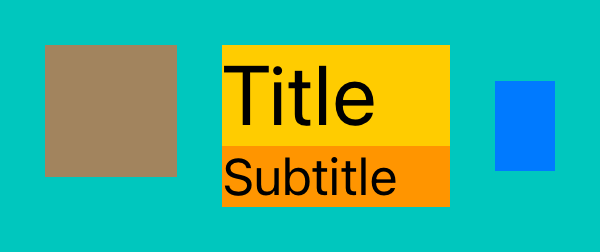
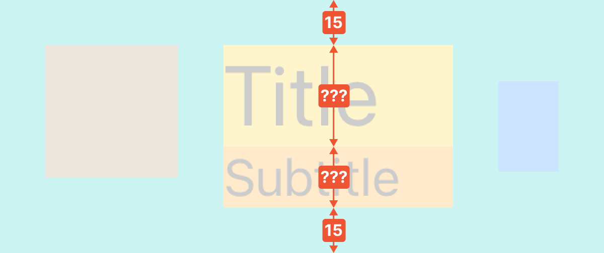
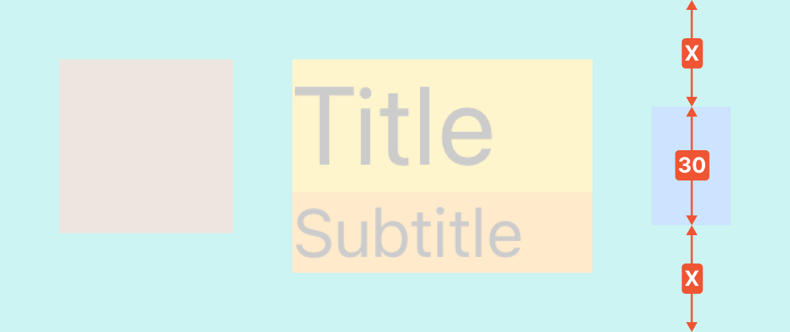
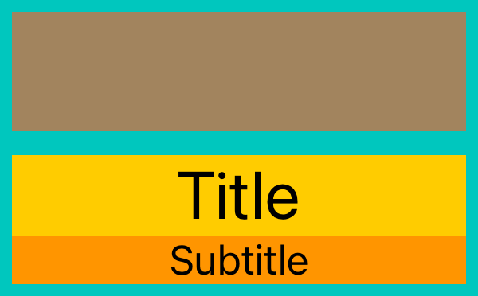
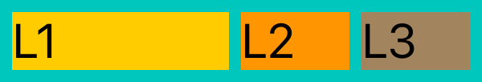
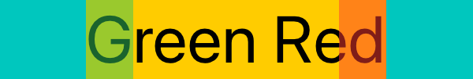
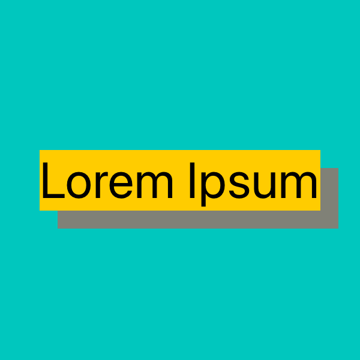

<p align="center">

</p>
      
`FixFlex` is a simple yet powerful Auto Layout library built on top of the NSLayoutAnchor API, a swifty and type-safe reimagination of [Visual Format Language](https://developer.apple.com/library/archive/documentation/UserExperience/Conceptual/AutolayoutPG/VisualFormatLanguage.html)

## Features

- Auto Layout code that is easy to write, read, and modify
- Simple API with 2 functions and 4 specifiers, covering 99% of layout use cases
- Lightweight, implementation is only 300 lines of code
- Compatible with any other Auto Layout code
- Basically generates a bunch of `NSLayoutConstraint` and `UILayoutGuide`
- Super straightforward mental model
- Typesafe alternative to VFL
- Automatically sets `translatesAutoresizingMaskIntoConstraints` to false
- Supports iOS 12.0+ / Mac OS X 10.13+ / tvOS 12.0+

## Usage

Imagine we want to create a layout like this:



1. Let's scan the layout horizontally and translate it into FixFlex code:


Most of the views and spacings have a fixed width (`Fix`), while the title and subtitle widths are flexible, designed to occupy the remaining space (`Flex`):

```swift
parent.fx.hput(Fix(15),
               Fix(iconView, 44),
               Fix(15),
               Flex([titleLabel, subtitleLabel]),
               Fix(15),
               Fix(chevron, 20),
               Fix(15))
```

2. Vertically, we have three distinct groups of views. Starting with the icon:


We do a spacing at the top using `Fix`. The bottom spacing should be at least 15pt, for the case when the labels' height is less than the icon's height:

```swift
parent.fx.vput(Fix(15),
               Fix(iconView, 44),
               Flex(min: 15))
```

3. Next, we perform a vertical scan of the title and subtitle:



```swift
parent.fx.vput(Fix(15),
               Flex(titleLabel),
               Flex(subtitleLabel),
               Fix(15))
```

4. Finally, we scan the chevron vertically:



To center the chevron, we ensure the top spacing is equal to the bottom spacing using `Grow`:

```swift
parent.fx.vput(Grow(),
               Fix(chevron, 30),
               Grow())
```

That's it! The best part is how easy it is to modify FixFlex layout code, inserting extra padding or views effortlessly, without the need to rewire constraints.

## API

### hput/vput

`FixFlex` provides two functions for laying out views horizontally (`hput`) and vertically (`vput`), accessible through the `view.fx.*` namespace.

You can specify `startAnchor`/`endAnchor` to layout items between arbitrary anchors instead of the view's edges.

By default, `hput` works in natural positioning mode and operates using `leadingAnchor`/`trailingAnchor`. This setup ensures that the layout is mirrored for Right-to-Left (RTL) languages. However, this behavior can be overridden by enabling the `useAbsolutePositioning` flag. When this flag is set to true, `hput` shifts to using `leftAnchor`/`rightAnchor` for layout positioning.

```swift
func hput(
        startAnchor: NSLayoutXAxisAnchor? = nil, // if nil, we use leadingAnchor or leftAnchor
        endAnchor: NSLayoutXAxisAnchor? = nil, // if nil, we use trailingAnchor or rightAnchor
        useAbsolutePositioning: Bool = false, // if true, we use leftAnchor/rightAnchor based positioning (force Left-To-Right)
        _ intents: PutIntent...
    ) -> PutResult
```

```swift
func vput(
        startAnchor: NSLayoutYAxisAnchor? = nil, // if nil, we use topAnchor
        endAnchor: NSLayoutYAxisAnchor? = nil, // if nil, we use bottomAnchor
        _ intents: PutIntent...
    ) -> PutResult
```

A `PutIntent` is essentially an instruction for calculating the width or height of:

- a spacer (for which a `UILayoutGuide` is created behind the scenes)
- a view
- an array of views (when they are aligned in parallel)

Concrete instances of `PutIntent` can be created using specialized builder functions:

### Fix

Used for specifying the exact size of a view/spacer.

```swift
func Fix(_ value: CGFloat) -> PutIntent

func Fix(_ view: _View, _ value: CGFloat) -> PutIntent

func Fix(_ views: [_View], _ value: CGFloat) -> PutIntent
```

### Flex

Useful for sizes that change dynamically. Optionally, it is possible to specify min/max constraints and in-place priority settings for hugging and compression resistance.

```swift
func Flex(min: CGFloat? = nil, max: CGFloat? = nil) -> PutIntent

func Flex(_ view: _View, min: CGFloat? = nil, max: CGFloat? = nil, huggingPriority: _LayoutPriority? = nil, compressionResistancePriority: _LayoutPriority? = nil) -> PutIntent

func Flex(_ views: [_View], min: CGFloat? = nil, max: CGFloat? = nil, huggingPriority: _LayoutPriority? = nil, compressionResistancePriority: _LayoutPriority? = nil) -> PutIntent
```

### Grow

`Grow` allows a view/spacer to proportionally occupy the available free space based on its weight. It's particularly useful for achieving equal spacing, centering elements, or for designing symmetrical layouts like tables or grids.

```swift
func Grow(weight: CGFloat = 1.0) -> PutIntent

func Grow(_ view: _View, weight: CGFloat = 1.0) -> PutIntent

func Grow(_ views: [_View], weight: CGFloat = 1.0) -> PutIntent
```

### Match

This is used to match the size of a view or spacer to a specified `NSLayoutDimension`. It is particularly useful for aligning the sizes of different views or spacers, or for making their sizes proportional to each other.

```swift
public func Match(dimension: NSLayoutDimension, multiplier: CGFloat? = nil, offset: CGFloat? = nil) -> PutIntent

public func Match(_ view: _View, dimension: NSLayoutDimension, multiplier: CGFloat? = nil, offset: CGFloat? = nil) -> PutIntent

public func Match(_ views: [_View], dimension: NSLayoutDimension, multiplier: CGFloat? = nil, offset: CGFloat? = nil) -> PutIntent
```

## Examples


### Fill Parent With Inset


```swift
let child = UIView()
child.backgroundColor = .systemYellow

let parent = UIView()
parent.translatesAutoresizingMaskIntoConstraints = false
parent.backgroundColor = .systemMint
parent.addSubview(child)

parent.widthAnchor.constraint(equalToConstant: 200).isActive = true
parent.heightAnchor.constraint(equalToConstant: 100).isActive = true

parent.fx.hput(Fix(15),
               Flex(child),
               Fix(15))

parent.fx.vput(Fix(15),
               Flex(child),
               Fix(15))
```


### Pin To Parent Trailing Bottom


```swift
let child = UIView()
child.backgroundColor = .systemYellow

let parent = UIView()
parent.translatesAutoresizingMaskIntoConstraints = false
parent.backgroundColor = .systemMint
parent.addSubview(child)

parent.widthAnchor.constraint(equalToConstant: 200).isActive = true
parent.heightAnchor.constraint(equalToConstant: 100).isActive = true

parent.fx.hput(Flex(),
               Fix(child, 100),
               Fix(15))

parent.fx.vput(Flex(),
               Fix(child, 50),
               Fix(15))
```


### Center In Parent


```swift
let child = UIView()
child.backgroundColor = .systemYellow

let parent = UIView()
parent.translatesAutoresizingMaskIntoConstraints = false
parent.backgroundColor = .systemMint
parent.addSubview(child)

parent.widthAnchor.constraint(equalToConstant: 200).isActive = true
parent.heightAnchor.constraint(equalToConstant: 100).isActive = true

parent.fx.hput(Grow(),
               Fix(child, 100),
               Grow())

parent.fx.vput(Grow(),
               Fix(child, 50),
               Grow())
```


### Center Label In Parent


```swift
let label = UILabel()
label.text = "topLabel"
label.font = .preferredFont(forTextStyle: .title1)
label.adjustsFontForContentSizeCategory = true
label.backgroundColor = .systemYellow

let parent = UIView()
parent.translatesAutoresizingMaskIntoConstraints = false
parent.backgroundColor = .systemMint
parent.addSubview(label)

parent.widthAnchor.constraint(equalToConstant: 200).isActive = true
parent.heightAnchor.constraint(equalToConstant: 200).isActive = true

parent.fx.hput(Grow(),
               Flex(label),
               Grow())

parent.fx.vput(Grow(),
               Flex(label),
               Grow())
```


### Vertically Center Two Labels


```swift
let topLabel = UILabel()
topLabel.text = "topLabel"
topLabel.font = .preferredFont(forTextStyle: .title1)
topLabel.adjustsFontForContentSizeCategory = true
topLabel.backgroundColor = .systemYellow

let bottomLabel = UILabel()
bottomLabel.text = "bottomLabel"
bottomLabel.font = .preferredFont(forTextStyle: .caption1)
bottomLabel.adjustsFontForContentSizeCategory = true
bottomLabel.backgroundColor = .systemOrange

let parent = UIView()
parent.translatesAutoresizingMaskIntoConstraints = false
parent.backgroundColor = .systemMint
parent.addSubview(topLabel)
parent.addSubview(bottomLabel)

parent.widthAnchor.constraint(equalToConstant: 200).isActive = true
parent.heightAnchor.constraint(equalToConstant: 200).isActive = true

parent.fx.hput(Flex([topLabel, bottomLabel]))

parent.fx.vput(Grow(),
               Flex(topLabel),
               Fix(5),
               Flex(bottomLabel),
               Grow())
```


### Cell With Icon Title Subtitle And Chevron


```swift
let iconView = UIView()
iconView.backgroundColor = .systemBrown

let titleLabel = UILabel()
titleLabel.text = "Title"
titleLabel.font = .preferredFont(forTextStyle: .title1)
titleLabel.adjustsFontForContentSizeCategory = true
titleLabel.backgroundColor = .systemYellow

let subtitleLabel = UILabel()
subtitleLabel.text = "Subtitle"
subtitleLabel.font = .preferredFont(forTextStyle: .body)
subtitleLabel.adjustsFontForContentSizeCategory = true
subtitleLabel.backgroundColor = .systemOrange

let chevron = UIView()
chevron.backgroundColor = .systemBlue

let parent = UIView()
parent.translatesAutoresizingMaskIntoConstraints = false
parent.backgroundColor = .systemMint

parent.addSubview(iconView)
parent.addSubview(titleLabel)
parent.addSubview(subtitleLabel)
parent.addSubview(chevron)

parent.widthAnchor.constraint(equalToConstant: 200).isActive = true

parent.fx.hput(Fix(15),
               Fix(iconView, 44),
               Fix(15),
               Flex([titleLabel, subtitleLabel]),
               Fix(15),
               Fix(chevron, 20),
               Fix(15))

parent.fx.vput(Fix(15),
               Fix(iconView, 44),
               Flex(min: 15))

parent.fx.vput(Fix(15),
               Flex(titleLabel),
               Flex(subtitleLabel),
               Fix(15))

parent.fx.vput(Grow(),
               Fix(chevron, 30),
               Grow())
```


### Card With Icon Title And Subtitle



```swift
let iconView = UIView()
iconView.backgroundColor = .systemBrown

let titleLabel = UILabel()
titleLabel.text = "Title"
titleLabel.font = .preferredFont(forTextStyle: .title1)
titleLabel.adjustsFontForContentSizeCategory = true
titleLabel.backgroundColor = .systemYellow
titleLabel.textAlignment = .center

let subtitleLabel = UILabel()
subtitleLabel.text = "Subtitle"
subtitleLabel.font = .preferredFont(forTextStyle: .body)
subtitleLabel.adjustsFontForContentSizeCategory = true
subtitleLabel.backgroundColor = .systemOrange
subtitleLabel.textAlignment = .center

let parent = UIView()
parent.translatesAutoresizingMaskIntoConstraints = false
parent.backgroundColor = .systemMint

parent.addSubview(iconView)
parent.addSubview(titleLabel)
parent.addSubview(subtitleLabel)

parent.widthAnchor.constraint(equalToConstant: 200).isActive = true

parent.fx.hput(Fix(5),
               Flex([iconView, titleLabel, subtitleLabel]),
               Fix(5))

parent.fx.vput(Fix(5),
               Fix(iconView, 50),
               Fix(10),
               Flex(titleLabel),
               Flex(subtitleLabel),
               Fix(5))
```


### Labels Row With Not Enough Space For Both


```swift
let leftLabel = UILabel()
leftLabel.text = "leftLabel"
leftLabel.font = .preferredFont(forTextStyle: .title1)
leftLabel.adjustsFontForContentSizeCategory = true
leftLabel.backgroundColor = .systemYellow

let rightLabel = UILabel()
rightLabel.text = "rightLabel"
rightLabel.font = .preferredFont(forTextStyle: .title1)
rightLabel.adjustsFontForContentSizeCategory = true
rightLabel.backgroundColor = .systemOrange

let parent = UIView()
parent.translatesAutoresizingMaskIntoConstraints = false
parent.backgroundColor = .systemMint
parent.addSubview(leftLabel)
parent.addSubview(rightLabel)

parent.widthAnchor.constraint(equalToConstant: 200).isActive = true

parent.fx.vput(Flex([leftLabel, rightLabel]))

parent.fx.hput(Flex(leftLabel, compressionResistancePriority: .required),
               Fix(5),
               Flex(rightLabel))
```


### Labels Split



```swift
let label1 = UILabel()
label1.text = "L1"
label1.font = .preferredFont(forTextStyle: .title3)
label1.adjustsFontForContentSizeCategory = true
label1.backgroundColor = .systemYellow

let label2 = UILabel()
label2.text = "L2"
label2.font = .preferredFont(forTextStyle: .title3)
label2.adjustsFontForContentSizeCategory = true
label2.backgroundColor = .systemOrange

let label3 = UILabel()
label3.text = "L3"
label3.font = .preferredFont(forTextStyle: .title3)
label3.adjustsFontForContentSizeCategory = true
label3.backgroundColor = .systemBrown

let parent = UIView()
parent.translatesAutoresizingMaskIntoConstraints = false
parent.backgroundColor = .systemMint
parent.addSubview(label1)
parent.addSubview(label2)
parent.addSubview(label3)

parent.widthAnchor.constraint(equalToConstant: 200).isActive = true

parent.fx.vput(Fix(5),
               Flex([label1, label2, label3]),
               Fix(5))

parent.fx.hput(Fix(5),
               Grow(label1, weight: 2),
               Fix(5),
               Grow(label2),
               Fix(5),
               Grow(label3),
               Fix(5))
```


### Flex Min Max


```swift
let label1 = UILabel()
label1.text = "Elit Aenean"
label1.font = .preferredFont(forTextStyle: .title1)
label1.adjustsFontForContentSizeCategory = true
label1.backgroundColor = .systemYellow

let label2 = UILabel()
label2.text = "Elit Aenean"
label2.font = .preferredFont(forTextStyle: .title1)
label2.adjustsFontForContentSizeCategory = true
label2.backgroundColor = .systemOrange

let label3 = UILabel()
label3.text = "Elit Aenean"
label3.font = .preferredFont(forTextStyle: .title1)
label3.adjustsFontForContentSizeCategory = true
label3.backgroundColor = .systemBrown

let parent = UIView()
parent.translatesAutoresizingMaskIntoConstraints = false
parent.backgroundColor = .systemMint
parent.addSubview(label1)
parent.addSubview(label2)
parent.addSubview(label3)

parent.widthAnchor.constraint(equalToConstant: 200).isActive = true

parent.fx.vput(Fix(5),
               Flex(label1),
               Flex(label2),
               Flex(label3),
               Fix(5))

parent.fx.hput(Fix(5),
               Flex(label1),
               Flex(),
               Fix(5))

parent.fx.hput(Fix(5),
               Flex(label2, min: 175),
               Flex(),
               Fix(5))

parent.fx.hput(Fix(5),
               Flex(label3, max: 100),
               Flex(),
               Fix(5))
```


### Put Between Anchors



```swift
let label = UILabel()
label.text = "Green Red"
label.font = .preferredFont(forTextStyle: .title1)
label.adjustsFontForContentSizeCategory = true
label.backgroundColor = .systemYellow

let leadingView = UIView()
leadingView.backgroundColor = .systemGreen.withAlphaComponent(0.5)

let trailingView = UIView()
trailingView.backgroundColor = .systemRed.withAlphaComponent(0.5)

let parent = UIView()
parent.translatesAutoresizingMaskIntoConstraints = false
parent.backgroundColor = .systemMint
parent.addSubview(label)
parent.addSubview(leadingView)
parent.addSubview(trailingView)

parent.widthAnchor.constraint(equalToConstant: 200).isActive = true

parent.fx.vput(Flex([label, leadingView, trailingView]))

parent.fx.hput(Grow(),
               Flex(label),
               Grow())

parent.fx.hput(startAnchor: label.leadingAnchor,
               endAnchor: label.trailingAnchor,
               Fix(leadingView, 20),
               Flex(),
               Fix(trailingView, 20))
```


### Put Between Anchors Absolute


```swift
let label = UILabel()
label.text = "Green Red"
label.font = .preferredFont(forTextStyle: .title1)
label.adjustsFontForContentSizeCategory = true
label.backgroundColor = .systemYellow

let leadingView = UIView()
leadingView.backgroundColor = .systemGreen.withAlphaComponent(0.5)

let trailingView = UIView()
trailingView.backgroundColor = .systemRed.withAlphaComponent(0.5)

let parent = UIView()
parent.translatesAutoresizingMaskIntoConstraints = false
parent.backgroundColor = .systemMint
parent.addSubview(label)
parent.addSubview(leadingView)
parent.addSubview(trailingView)

parent.widthAnchor.constraint(equalToConstant: 200).isActive = true

parent.fx.vput(Flex([label, leadingView, trailingView]))

parent.fx.hput(Grow(),
               Flex(label),
               Grow())

parent.fx.hput(startAnchor: label.leftAnchor,
               endAnchor: label.rightAnchor,
               useAbsolutePositioning: true,
               Fix(leadingView, 20),
               Flex(),
               Fix(trailingView, 20))
```


### Shadow Using Match



```swift
let label = UILabel()
label.text = "Lorem Ipsum"
label.font = .preferredFont(forTextStyle: .title1)
label.adjustsFontForContentSizeCategory = true
label.backgroundColor = .systemYellow

let matchView = UIView()
matchView.backgroundColor = .systemRed.withAlphaComponent(0.5)

let parent = UIView()
parent.translatesAutoresizingMaskIntoConstraints = false
parent.backgroundColor = .systemMint

parent.addSubview(matchView)
parent.addSubview(label)

parent.widthAnchor.constraint(equalToConstant: 200).isActive = true
parent.heightAnchor.constraint(equalToConstant: 200).isActive = true

parent.fx.vput(Grow(),
               Flex(label),
               Grow())

parent.fx.hput(Grow(),
               Flex(label),
               Grow())

parent.fx.vput(startAnchor: label.topAnchor,
               Fix(10),
               Match(matchView, dimension: label.heightAnchor),
               Flex())

parent.fx.hput(startAnchor: label.leadingAnchor,
               Fix(10),
               Match(matchView, dimension: label.widthAnchor),
               Flex())
```


## Integration

Use Swift Package Manager and add dependency to `Package.swift` file.

```swift
  dependencies: [
    .package(url: "https://github.com/psharanda/FixFlex.git", .upToNextMajor(from: "1.0.0"))
  ]
```

Alternatively, in Xcode select `File > Add Package Dependencies…` and add FixFlex repository URL:

```
https://github.com/psharanda/FixFlex.git
```

## Contributing

We welcome contributions! If you find a bug, have a feature request, or want to contribute code, please open an issue or submit a pull request.

## License

FixFlex is available under the MIT license. See the LICENSE file for more info.
